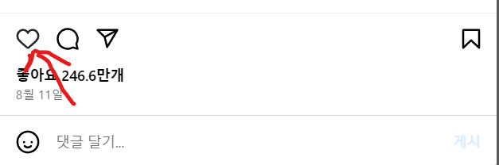
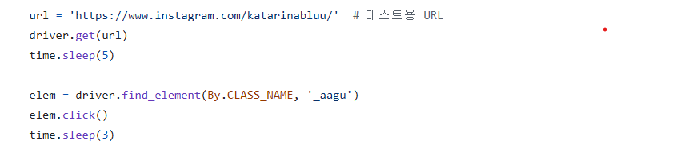

### 인스타그램 자동화

이 파이썬 코드는 셀레니움 라이브러리를 사용하여 자동으로 인스타그램에 하트눌러줍니다 

### 사용방법

1. 먼저 login.py를 실행하면 인스타그램 페이지로 이동을 하는데요 이동한 뒤에 로그인을 하면 컴퓨터에 로그인이 정보가 남아 셀레니움으로 자동화를 실행 할때 마다 로그인을 안해도 됩니다

2. 그 후 cr.py를 실행 하면 해당 url 변수에 있는 페이지로 이동하여 게시물 첫번째를 클릭 후 하트를 누릅니다